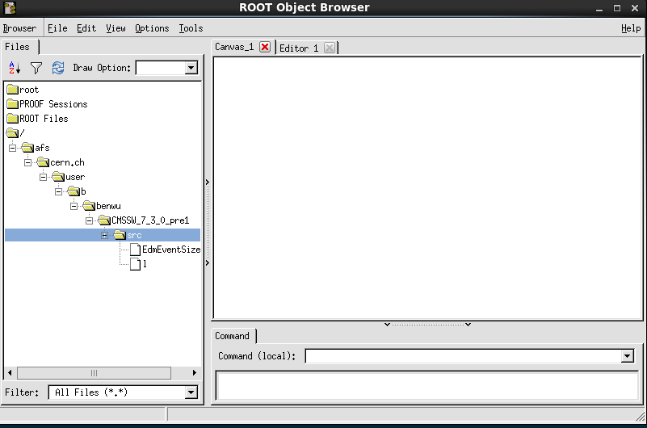
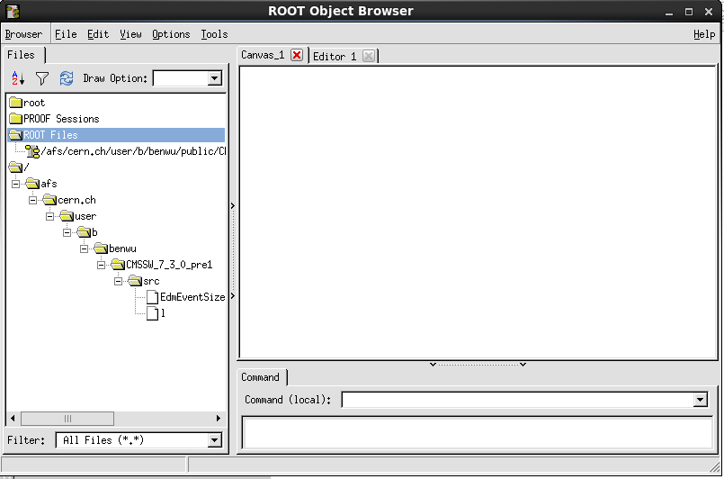
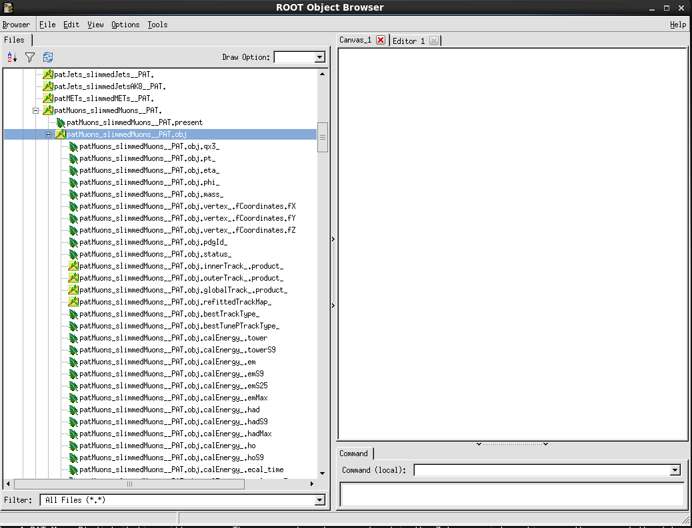
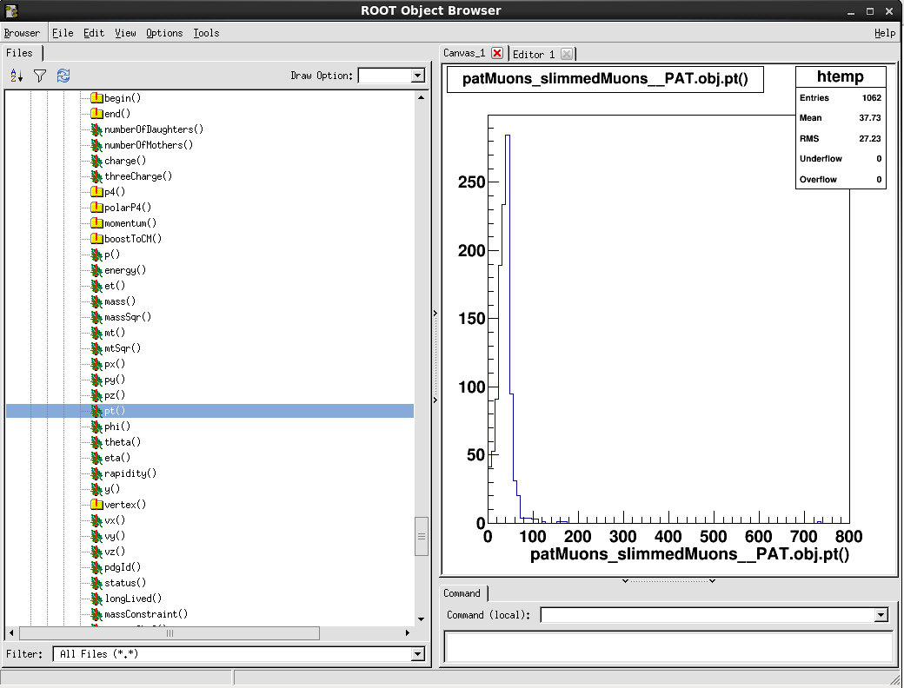

# Introduction

Welcome to the first set of CMS Data Analysis School (CMSDAS) pre-exercises. The purpose of these exercises is to become familiar with the basic software tools required to perform physics analysis at the school. Please run and complete these exercises. Throughout the exercises there will be questions for you to answer. Submit your answers in the online response form available from **the course web area** - For CMSDAS@LPC {{ site.year }}, Fermilab, the complete set of links can be found at the [CMSDAS pre-exercises indico page](https://indico.cern.ch/event/966368/). A large amount of additional information about these exercises is available in the twikis that we reference. Please remember that twikis evolve but aim to provide the best information at any time.

> ## Note
> The CMSDAS exercises (pre-exercises as well as exercises during the school) are intended to be as generic as possible. However, CMSDAS is held at different CMS collaborating institutes - e.g. the LPC at Fermilab, DESY, etc.) Participants are expected to **request and obtain local (at the intended school location) computer accounts** well in advance of the school start date, to ensure they will be able to work right away. It is very important for participants to use the pre-exercises as a setup tool, so we recommend for everyone to **use the same laptop they intend to bring with them at the school** (NO computer/laptop will be provided at the school), and to **connect to the local computing resources that will be used for the school**. In most cases laptops will need to be registered to be used in the local school network, so please make sure you take care of this aspect too. 
>
{: .callout}

There are several sets of pre-exercises. As outlined above, if you are going through the pre-exercises in preparation to attending a CMSDAS, we strongly recommend using the laptop you intend to bring to the school and logging into the cluster local to the school.

# Exercise 1 - Simple cut and paste exercise

This exercise is designed to run only on **cmslpc-sl7** as copies of the scripts are present there.

Login to the **cmslpc-sl7** cluster. If you are preparing for CMSDAS@LPC {{ site.year }} please know that the **cmslpc-sl7** is the cluster you are supposed to use. By now you should have a FNAL account that you can use to get kerberos credential and follow the instructions on how to log in to the LPC cluster.

As the exercises often require copying and pasting from instruction, we will make sure that you will have no problems. To verify if cut and paste to/from a terminal window works, first copy the script [runThisCommand.py]({{ page.root }}) as follows.

To connect to **cmslpc-sl7** at Fermilab, try the following commands (Mac/Linux, Windows use the putty or cygwin instructions above):
```shell
kinit <YourUsername>@FNAL.GOV
```
{: .source}

replacing `<YourUsername>` with your actual username. Then enter the kerberos principal password for your account. Next, connect to the cluster using the command:
```shell
ssh -Y <YourUsername>@cmslpc-sl7.fnal.gov
```
{: .source}

 Once connected use the following command to copy the `runThisCommand.py` script and make it so that the script is executable (Mac/Linux/Windows):
```shell
cp ~cmsdas/runThisCommand.py .
chmod +x runThisCommand.py
```
{: .source}

 Next, cut and paste the following and then hit return:
 ```shell
./runThisCommand.py "asdf;klasdjf;kakjsdf;akjf;aksdljf;a" "sldjfqewradsfafaw4efaefawefzdxffasdfw4ffawefawe4fawasdffadsfef"
 ```
{: .source}

 The response should be your username followed by alphanumeric string of characters unique to your username, for example for a user named `gbenelli`:

```
success: gbenelli toraryyv
```
{: .output}

If you executed the command without copy-pasting (i.e. only `./runThisCommand.py` without the additional arguments) the command will return:

```
Error: You must provide the secret key
```
{: .output}

Alternatively, copying incorrectly (i.e. different arguments) will return:

```
Error: You didn't paste the correct input string
```
{: .output}

If you are not running on cmslpc-sl7 (for example locally on a laptop), trying to run the command will result in:

```
bash: ./runThisCommand.py: No such file or directory
```
{: .output}

or (for example):

```
Unknown user: gbenelli.
```
{: .output}

> ## Question 1
> Post the alphanumeric string of characters unique to your username. For CMSDAS@LPC {{ site.year }} please submit your answers for the [CMSDAS@LPC {{ site.year }} Google Form first set](https://forms.gle/yZmRUNkfk2E2tD7Y8). NOTE, answer only Question 1 at this point. Question 2 in the form is related to the next exercise. There is a one-to-one correspondence between the question numbers here and in the Google Form.
{: .challenge}

# Exercise 2 - Simple edit exercise

 This exercise is designed to run only on **cmslpc-sl7**.

The purpose of this exercise is to ensure that the user can edit files. We will first copy and then edit the [editThisCommand.py]({{ page.root }}) script. *This means that you need to be able to use one of the standard text editors (emacs, pico, nano, vi, vim, etc.) available on the cluster you are running (**cmslpc-sl7**), open a file, edit it and save it!*

On the **cmslpc-sl7** cluster, run:

```shell
cp ~cmsdas/editThisCommand.py .
```
{: .source}

Then open `editThisCommand.py` with your favorite editor (e.g. `emacs -nw editThisCommand.py`) and make sure that the 11th line has `#` (hash character) as the first character of the line. If not, explicitly change the following three lines:

```python
# Please comment the line below out by adding a '#' to the front of
# the line.
raise RuntimeError, "You need to comment out this line with a #"
```
{: .source}

to:

```python
# Please comment the line below out by adding a '#' to the front of
# the line.
#raise RuntimeError, "You need to comment out this line with a #"
```
{: .source}

Save the file (e.g. in emacs `CTRL+x CTRL+s` to save, `CTRL+x CTRL+c` to quit the editor) and execute the command:

```shell
./editThisCommand.py
```
{: .source}

If this is successful, the result will be:

```
success:  gbenelli 0x6D0DB4E0
```
{: .output}

If the file has not been successfully edited, an error message will result such as:

```
Traceback (most recent call last):
  File "./editThisCommand.py", line 11, in ?
    raise RuntimeError, "You need to comment out this line with a #"
RuntimeError: You need to comment out this line with a #
```
{: .output}

> ## Question 2
> Paste the line beginning with "success", resulting from the execution of `./editThisCommand.py`, into the form provided.
{: .challenge}

# Exercise 3 - Setup a CMSSW release area

CMSSW is the CMS SoftWare framework used in our collaboration to process and analyze data. In order to use it, you need to set up your environment and set up a local CMSSW release.

At Fermilab **cmslpc-sl7** users have a 2GB home area at `/uscms/homes/Y/YOURUSERNAME` and a larger mass storage area called the nobackup area, which is linked from your home directory at **cmslpc-sl7** (if you do `ls -alh |grep nobackup` you will see something like `nobackup -> /uscms_data/d3/YOURUSERNAME`) for the exercises. In both of these cases `YOURUSERNAME` is a placeholder for your actual username (you can do `whoami` to see your actual username). You will first want to set up the proper environment by entering the following commands, depending on what shell you use:

```bash
source /cvmfs/cms.cern.ch/cmsset_default.sh
export CMSSW_GIT_REFERENCE=/cvmfs/cms.cern.ch/cmssw.git.daily
```
{: .source}

```sh
source /cvmfs/cms.cern.ch/cmsset_default.csh
setenv CMSSW_GIT_REFERENCE /cvmfs/cms.cern.ch/cmssw.git.daily
```
{: .source}

> Actually you should edit your `~/.tcshrc` file (or `~/.bash_profile` if bash is your default shell), create it if you do not have one, to include the above commands so that you do not have to execute each time you log into the cluster. **Note** If you wish to change your default shell, use the method [documented here in the setup software instructions](https://uscms.org/uscms_at_work/physics/computing/setup/setup_software.shtml#shell). A shell change will take up to 1 business day to complete.
{: .callout}

Proceed with the creation of a working area (called YOURWORKINGAREA in the following): 

```shell
cd ~/nobackup
mkdir YOURWORKINGAREA
cd YOURWORKINGAREA
### If you are using the default tcsh shell (or csh shell)
setenv SCRAM_ARCH slc7_amd64_gcc700 
### Alternatively, If you are using Bash shell 
export SCRAM_ARCH=slc7_amd64_gcc700
cmsrel CMSSW_10_6_18
cd CMSSW_10_6_18/src
cmsenv
```
{: .source}

To be able to check out specific CMSSW packages from [GitHub], you will need to configure your local account following the [FifthSet PreExecises Git configuration]({{ page.root }}). You only have to do this command **once** for any given cluster you are working on: 

```shell
git config --global user.name [Name]
git config --global user.email [Email]
git config --global user.github [Account]
```
{: .source}

> ## Note
> To see your current git configuration you can use the following command:
> ~~~shell
> git config --global -l
> ~~~
> {: .source}
> More information will be given in the [fifth set of pre-exercises]({{ page.root }}).
{: .callout}

Now you can initialize the CMSSW area as a local git repository:

```shell
git cms-init
```
{: .source}

This last command will take some time to execute and will produce some long output, be patient.

When you get the prompt again, run the following command:

```shell
echo $CMSSW_BASE
```
{: .source}

> ## Question 3
> Paste the result of executing the above command in the form.
{: .challenge}

> ## Note
> The directory (on **cmslpc-sl7**) `~/nobackup/YOURWORKINGAREA/CMSSW_10_6_18/src` is referred to as your *WORKING DIRECTORY*.
{: .callout}

Every time you log out or exit a session you will need to setup your environment in your working directory again. To do so, once you have executed once the steps above (assuming you have added the `source /cvmfs/cms.cern.ch/cmsset_default.(c)sh` in your `~/.tcshrc` or `~/.bash_profile` file), you simply:

```shell
cd ~/nobackup/YOURWORKINGAREA/CMSSW_10_6_18/src
cmsenv
```
{: .source}

And you are ready to go!

# Exercise 4 - Find data in the Data Aggregation Service (DAS)

In this exercise we will locate the MC dataset **RelValZMM** and the collision dataset **/DoubleMuon/Run2018A-12Nov2019_UL2018-v2/MINIAOD** using the **Data Aggregation Service** (not to be confused with the **Data Analysis School** in which you are partaking!). Also be aware that [DAS][das] is an improved database access service known many years ago as DBS (Dataset Bookkeeping System).

Go to the [DAS][das] webpage. You will be asked for your Grid certificate, which you should have loaded into your browser by now. Also note that there may be a security warning message, which you will need to ignore and still load the page. From there, enter the following into the space provided:

```
dataset release=CMSSW_10_6_14 dataset=/RelValZMM*/*CMSSW_10_6_14*/MINIAOD*
```
{: .source}

This will search for datasets, processed with release `CMSSW_10_6_14`, which is named like `/RelValZMM*/*CMSSW_10_6_14*/MINIAOD*`. The syntax for searches is found [here](https://cmsweb.cern.ch/das/faq), with many useful common search patterns under "CMS Queries".

For this query, several results should be displayed (you may be queried for security exceptions in the process). Select (click) on the dataset name **/RelValZMM_13/CMSSW_10_6_14-106X_mc2017_realistic_v7-v1/MINIAODSIM** and after a few seconds another page will appear.

> ## Question 4.1a
> What is the size of this dataset in MB? Make sure your answer is only numerical (no units)
{: .challenge}

> ## Question 4.1b
> Click on "Sites" to get a list of sites hosting this data. Is this data at FNAL or DESY?
{: .challenge}

Back in the main dataset page, click on the "Files" link to get a list of the ROOT files in our selected dataset. One of the files it contains should look like this:

```
/store/relval/CMSSW_10_6_14/RelValZMM_13/MINIAODSIM/106X_mc2017_realistic_v7-v1/10000/0EB976F4-F84B-814D-88DA-CB2C29A52D72.root
```
{: .output}

If you want to know the name of the dataset from the name of a file, one can go to [DAS][das] and type:

```
dataset file=/store/relval/CMSSW_10_6_14/RelValZMM_13/MINIAODSIM/106X_mc2017_realistic_v7-v1/10000/0EB976F4-F84B-814D-88DA-CB2C29A52D72.root 
```
{: .source}

and hit "Enter". 

Now we will locate a collisions dataset skim using the keyword search, which is sometimes more convenient if you know the dataset you are looking for.

In [DAS][das] type:

```
dataset=/DoubleMu*/*Run2018A*/MINIAOD* 
```
{: .source}

and hit "Enter".

> ## Question 4.2
> What release was the dataset **/DoubleMuon/Run2018A-12Nov2019_UL2018-v2/MINIAOD** collected in?
> 
> **Note:** If you see more than one release, just answer with a single release.
{: .challenge}

Having set your CMSSW environment one can also search for the dataset **/DoubleMuon/Run2018A-12Nov2019_UL2018-v2/MINIAOD** by invoking the [DAS][das] command in your *WORKING DIRECTORY*. The [DAS][das] command `dasgoclient` is in the path for CMSSW_9_X_Y versions and above, so you do not need to download anything additional. More about `dasgoclient` can be found [here](https://cmsweb.cern.ch/das/faq).

The query we're interested in is: **/DoubleMuon/Run2018A-12Nov2019_UL2018-v2/MINIAOD**, see the commands below on how to execute it in the command-line. This assumes that you have installed your CERN grid certificate on **cmslpc-sl7**, if not, follow [Step 5](http://uscms.org/uscms_at_work/physics/computing/getstarted/get_grid_cert.shtml) to install.

**Note:** For **cmslpc-sl7** at the LPC at Fermilab you will need to init your Grid proxy beforehand:

```shell
voms-proxy-init --valid 192:00 --voms cms
```
{: .source}

You will be asked for your grid certificate passphrase. Then you can execute the query with:

```shell
dasgoclient --query="dataset=/DoubleMuon/Run2018A-12Nov2019_UL2018-v2/MINIAOD" --format=plain
```
{: .source}

You will see something like:

```
/DoubleMuon/Run2018A-12Nov2019_UL2018-v2/MINIAOD
```
{: .output}

More information about accessing data in the [Data Aggregation Service](https://cmsweb.cern.ch/das/faq) can be found in [WorkBookDataSamples](https://twiki.cern.ch/twiki/bin/view/CMSPublic/WorkBookDataSamples).

# Exercise 5 - Event Data Model (EDM) standalone utilities

The overall collection of CMS software, referred to as [CMSSW](https://twiki.cern.ch/twiki/bin/view/CMSPublic/WorkBookCMSSWFramework), is built around a framework, an Event Data Model ([EDM](https://twiki.cern.ch/twiki/bin/view/CMSPublic/WorkBookCMSSWFramework#EdM)), and services needed by the simulation, calibration and alignment, and reconstruction modules that process event data so that physicists can perform analysis. The primary goal of the Framework and EDM is to facilitate the development and deployment of reconstruction and analysis software. The CMS Event Data Model (EDM) is centered around the concept of an Event. An Event is a C++ object container for all RAW and reconstructed data related to a particular collision.To understand what is in a data file and more, several EDM utilities are available. In this exercise, one will use three of these EDM utilities. They will be very useful at CMSDAS and after. More about these EDM utilities can be found at [WorkBookEdmUtilities](https://twiki.cern.ch/twiki/bin/view/CMSPublic/WorkBookEdmUtilities). These together with the [GitHub web interface for CMSSW](https://github.com/cms-sw/cmssw) and the [CMS LXR Cross Referencer](https://cmssdt.cern.ch/lxr/) are very useful to understand and write CMS code. 

## edmFileUtil

First we will use the `edmFileUtil` to find the **physical file name** (PFN) where the file is actually stored at your site, given the **logical file name** (LFN) which is an alias that can be used in CMSSW at any site.

To do this, execute:

```shell
edmFileUtil -d /store/relval/CMSSW_10_6_14/RelValZMM_13/MINIAODSIM/106X_mc2017_realistic_v7-v1/10000/0EB976F4-F84B-814D-88DA-CB2C29A52D72.root
```
{: .source}

On **cmslpc-sl7** this will return:

```
root://cmsxrootd-site.fnal.gov//store/relval/CMSSW_10_6_14/RelValZMM_13/MINIAODSIM/106X_mc2017_realistic_v7-v1/10000/0EB976F4-F84B-814D-88DA-CB2C29A52D72.root
```
{: .output}

## edmDumpEventContent

Next we will use `edmDumpEventContent` to dump a summary of the products that are contained within the file we're interested in. We will be able to see what class names etc. to use in order to access the objects in the MiniAOD file.

If you want to look at a specific object (say, *slimmedMuons*), then execute:

```shell
edmDumpEventContent --all --regex slimmedMuons root://cmsxrootd-site.fnal.gov//store/relval/CMSSW_10_6_14/RelValZMM_13/MINIAODSIM/106X_mc2017_realistic_v7-v1/10000/0EB976F4-F84B-814D-88DA-CB2C29A52D72.root
```
{: .source}

This will return:

```
Type                                  Module           Label     Process        Full Name
-----------------------------------------------------------------------------------------
edm::RangeMap<CSCDetId,edm::OwnVector<CSCSegment,edm::ClonePolicy<CSCSegment> >,edm::ClonePolicy<CSCSegment> >    "slimmedMuons"   ""        "RECO"         CSCDetIdCSCSegmentsOwnedRangeMap_slimmedMuons__RECO
edm::RangeMap<DTChamberId,edm::OwnVector<DTRecSegment4D,edm::ClonePolicy<DTRecSegment4D> >,edm::ClonePolicy<DTRecSegment4D> >    "slimmedMuons"   ""        "RECO"         DTChamberIdDTRecSegment4DsOwnedRangeMap_slimmedMuons__RECO
vector<pat::Muon>                     "slimmedMuons"   ""        "RECO"         patMuons_slimmedMuons__RECO
```
{: .output}

The output of `edmDumpEventContent` has information divided into four variable width columns. The first column is the C++ class type of the data, the second is module label, the third is product instance label, and the fourth is the process name. More information is available at [Identifying Data in the Event](https://twiki.cern.ch/twiki/bin/view/CMSPublic/WorkBookCMSSWFramework#ModularEvtContent).

Instead of the above, try without the option `--regex slimmedMuons`. This will dump the entire event content - a file with many lines. For this reason we'll send the output to a file called `EdmDumpEventContent.txt` with a UNIX output redirection command (then you can inspect the file with your favorite editor or with `less EdmDumpEventContent.txt`:

```shell
edmDumpEventContent root://cmsxrootd-site.fnal.gov//store/relval/CMSSW_10_6_14/RelValZMM_13/MINIAODSIM/106X_mc2017_realistic_v7-v1/10000/0EB976F4-F84B-814D-88DA-CB2C29A52D72.root > EdmDumpEventContent.txt
```
{: .source}

> ## Question 5.1a
> How many modules produce products of type *vector*?
> 
> **Note:** We mean a plain `std::vector`, not a `BXVector` or any other type.
{: .challenge}

> ## Question 5.1b
> What are the names of three of the modules that produce products of type *vector*?
{: .challenge}

## edmProvDump

To aid in understanding the full history of an analysis, the framework accumulates provenance for all data stored in the standard ROOT output files. Using the command `edmProvDump` one can print out all the tracked parameters used to create the data file. For example, one can see which modules were run and the CMSSW version used to make the MiniAOD file. In executing the command below it is important to follow the instructions carefully, otherwise a large number of warning messages may appear. The *ROOT* warning messages can be ignored. 

To do this on **cmslpc-sl7** execute:

```shell
edmProvDump root://cmsxrootd-site.fnal.gov//store/relval/CMSSW_10_6_14/RelValZMM_13/MINIAODSIM/106X_mc2017_realistic_v7-v1/10000/0EB976F4-F84B-814D-88DA-CB2C29A52D72.root > EdmProvDump.txt
```
{: .source}

> ## Note
> EdmProvDump.txt is a very large file of the order of 40000-60000 lines. Open and look at this file and locate Processing History (about 20-40 lines from the top).
{: .callout}

> ## Question 5.2
> Which version of CMSSW was used to produce the MiniAOD file? The answer will take the form *CMSSW_X_Y_Z*, where you will need to fill in the *X*, *Y*, and *Z* with the correct numerical values.
{: .challenge}

## edmEventSize

Finally we will execute `edmEventSize` to determine the size of different branches in the data file. Further details about this utility may be found at [SWGuideEdmEventSize](https://twiki.cern.ch/twiki/bin/view/CMSPublic/SWGuideEdmEventSize). `edmEventSize` isn't actually a 'Core' helper function (anyone can slap 'edm' on the front of a program in CMSSW). You can use `edmFileUtil` to get a PFN from an LFN (as shown above) so you could combine the call.

At **cmslpc-sl7** execute the following command:

```shell
edmEventSize -v `edmFileUtil -d /store/relval/CMSSW_10_6_14/RelValZMM_13/MINIAODSIM/106X_mc2017_realistic_v7-v1/10000/0EB976F4-F84B-814D-88DA-CB2C29A52D72.root` > EdmEventSize.txt 
```
{: .source}

> ## Question 5.3
> What is the number of events if you execute the command at cmslpc-sl7?
{: .challenge}

Open and look at file *EdmEventSize.txt* and locate the line containing the text `patJets_slimmedJetsPuppi__RECO`. There are two numbers following this text that measure the plain and the compressed size of this branch.

> ## Question 5.4
> What are these two numbers?
{: .challenge}

# Exercise 6 - Get familiar with the MiniAOD format

Analyzing physics data at CMS is a very complicated task involving multiple steps, sharing of expertise, cross checks, and comparing different analysis. To maximize physics productivity, CMS developed a high-level data tier **MiniAOD** in Spring 2014 to serve the needs of the mainstream physics analyses while keeping a small event size (30-50 kb/event), with easy access to the algorithms developed by Physics Objects Groups (POGs) in the framework of the CMSSW offline software. The production of MiniAODs will be done centrally for common samples. Its goal is to centralize the production of PAT tuple which were used among the Physics Analysis Groups (PAGs) in Run 1. (Information about PAT can be found in [SWGuidePAT](https://twiki.cern.ch/twiki/bin/view/CMSPublic/SWGuidePAT) and in a [CMS conference note](http://cdsweb.cern.ch/record/1196152).) MiniAOD samples will be used in the Run 2 analysis. Hence it is important to know about this tool. More information about MiniAOD can be found in [WorkBookMiniAOD](https://twiki.cern.ch/twiki/bin/view/CMSPublic/WorkBookMiniAOD).

> ## Note
> A new data tier called **NanoAOD** has recently been developed. The goal of this tier is to centralize the ntuple production of ~50% of analyses and to keep the event size below 2kb/event. However, this pre-exercise will not cover the use of NanoAOD. More information can be found at [WorkBookNanoAOD](https://twiki.cern.ch/twiki/bin/view/CMSPublic/WorkBookNanoAOD). 
{: .callout}

The main contents of the MiniAOD are:

  - **High level physics objects** (leptons, photons, jets, ETmiss), with detailed information in order to allow e.g. retuning of identification criteria, saved using PAT dataformats. Some preselection requirements are applied on the objects, and objects failing these requirements are either not stored or stored only with a more limited set of information. Some high level corrections are applied: L1+L2+L3(+residual) corrections to jets, type1 corrections to ETmiss.
  - The full list of **particles reconstructed by the ParticleFlow**, though only storing the most basic quantities for each object (4-vector, impact parameter, pdg id, some quality flags), and with reduced numerical precision; these are useful to recompute isolation, or to perform jet substructure studies. For charged particles with pT > 0.9 GeV, more information about the associated track is saved, including the covariance matrix, so that they can be used for b-tagging purposes.
  - **MC Truth information:** a subset of the genParticles enough to describe the hard scattering process, jet flavour information, and final state leptons and photons; GenJets with pT > 8 GeV are also stored, and so are the other mc summary information (e.g event weight, LHE header, PDF, PU information). In addition, all the stable genParticles with mc status code 1 are also saved, to allow reclustering of GenJets with different algorithms and substructure studies.
  - **Trigger information:** MiniAOD contains the trigger bits associated to all paths, and all the trigger objects that have contributed to firing at least one filter within the trigger. In addition, we store all objects reconstructed at L1 and the L1 global trigger summary, and the prescale values of all the triggers.

Please note that the files used in the following are from older releases, but they still illustrate the points they intended to. To avoid the fact that RelVal files (produced to validate new release in the rapid CMSSW development cycle) become unavailable on a short (month) timescale, a small set of files have been copied to the LPC EOS storage. They are available at `root://cmseos.fnal.gov//store/user/cmsdas/2021/pre_exercises/Set1/`.

The Z to dimoun MC file `root://cmseos.fnal.gov//store/user/cmsdas/2021/pre_exercises/Set1/CMSDataAnaSch_MiniAODZMM730pre1.root` is made in `CMSSW_7_3_0_pre1` release and the datafile `root://cmseos.fnal.gov//store/user/cmsdas/2021/pre_exercises/Set1/CMSDataAnaSch_Data_706_MiniAOD.root` made from the collisions dataskim **/DoubleMu/CMSSW_7_0_6-GR_70_V2_AN1_RelVal_zMu2011A-v1/MINIAOD**.

In your working directory, try to open the root file `root://cmseos.fnal.gov//store/user/cmsdas/2021/pre_exercises/Set1/CMSDataAnaSch_MiniAODZMM730pre1.root`. Begin by opening ROOT:

```shell
root -l
```
{: .source}

>  ## Note
>  If you already have a custom `.rootrc` or `.rootlogon.C`, you can start ROOT without them by using the command `root -l -n`. 
{: .callout}

On the *ROOT* prompt, type, or copy-paste, the following:

```
gSystem->Load("libFWCoreFWLite.so");
FWLiteEnabler::enable();
gSystem->Load("libDataFormatsFWLite.so");
gROOT->SetStyle ("Plain");
gStyle->SetOptStat(111111);

TFile *theFile = TFile::Open("root://cmseos.fnal.gov//store/user/cmsdas/2021/pre_exercises/Set1/CMSDataAnaSch_MiniAODZMM730pre1.root");

TBrowser b;
```
{: .source}

> ## Note
> The TBrowser is a graphical ROOT file browser. It runs on the computer, where you started ROOT. Its graphical interface needs to be forwarded to your computer. This can be very slow. You either need a lot of patience, a good connection or you can try to run ROOT locally, copying the root files that are to be inspected. Since everyone is running a different operating system on their local computer, we do not support the setup of ROOT on your local computer. However, instructions exist on the [official ROOT website](https://root.cern.ch/downloading-root).
{: .callout}

> ## Note
> You can start the ROOT interpreter and open the file in a single step by doing:
> ~~~
> root -l <filename>
> ~~~
> {: .source} 
{: .callout}

To be able to use the member functions of a CMSSW data class from within ROOT, a 'dictionary' for that class needs to be available to ROOT. To obtain that dictionary, it is necessary to load the proper library into ROOT. The first three lines of the code above do exactly that. More information is at [WorkBookFWLiteExamples](https://twiki.cern.ch/twiki/bin/view/CMSPublic/WorkBookFWLiteExamples). Note that `gROOT->SetStyle ("Plain");` sets a plain white background for all the plots in ROOT.

> ## Note
> If the rootlogon.C is created in the home area, and the above four lines of code are in that file, the dictionary will be obtained, and all the plots will have a white background automatically upon logging in to ROOT.
{: .callout}

Now a ROOT browser window opens and looks like this ("Root Files" may or may not be selected):



In this window click on `ROOT Files` on the left menu and now the window looks like this:



Double-click on the ROOT file you opened: `root://cmseos.fnal.gov//store/user/cmsdas/2021/pre_exercises/Set1/CMSDataAnaSch_MiniAODZMM730pre1.root`, then `Events`, then scroll down and click `patMuons_slimmedMuons__PAT` (or the little + that appears next to it), and then `patMuons_slimmedMuons__PAT.obj`. A window appears that looks like this:



Scroll a long way down the file (not too fast) and click on `pt()`. A PAT Muon Pt distribution will appear. These muons have been produced in the Z to mumu interactions as the name of the data sample implies. 



> ## Question 6.1
> What is the mean value of the muon pt for this file (`root://cmseos.fnal.gov//store/user/cmsdas/2021/pre_exercises/Set1/CMSDataAnaSch_MiniAODZMM730pre1.root`)?
{: .challenge}

> ## Note
> To exit ROOT simply type `.q` in the command line.
{: .callout}

Now open the data file `root://cmseos.fnal.gov//store/user/cmsdas/2021/pre_exercises/Set1/CMSDataAnaSch_Data_706_MiniAOD.root`. Similarly run the following command, and answer the following question:

```shell
root -l
```
{: .source}

On the *ROOT* prompt type the following:

```
gSystem->Load("libFWCoreFWLite.so");
FWLiteEnabler::enable();
gSystem->Load("libDataFormatsFWLite.so");
gROOT->SetStyle ("Plain");
gStyle->SetOptStat(111111);

TFile *theFile = TFile::Open("root://cmseos.fnal.gov//store/user/cmsdas/2021/pre_exercises/Set1/CMSDataAnaSch_Data_706_MiniAOD.root");

TBrowser b;
```
{: .source}

> ## Question 6.2
> What is the mean value of the muon pt for the collision data (current file)?
{: .challenge}

> Be sure to submit your answers to the [Google Form first set](https://forms.gle/yZmRUNkfk2E2tD7Y8), then proceed to the [second set]({{ page.root }}).
{: .caution}

> ## Helpful Hint
> Rather than using the TBrowser, you can perform the drawing action using ROOT interpreter. An example is shown below:
> 
> ~~~
> root -l root://cmseos.fnal.gov//store/user/cmsdas/2021/pre_exercises/Set1/CMSDataAnaSch_MiniAODZMM730pre1.root
> Events->Draw("patMuons_slimmedMuons__PAT.obj.pt()")
> ~~~
> {: .source}
{: .callout}


