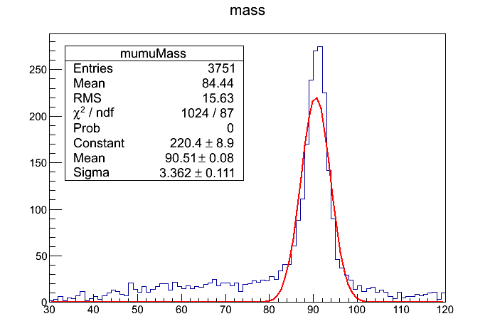
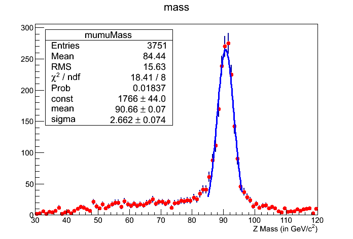
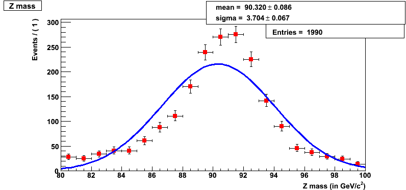
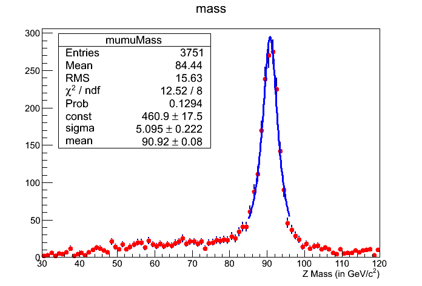
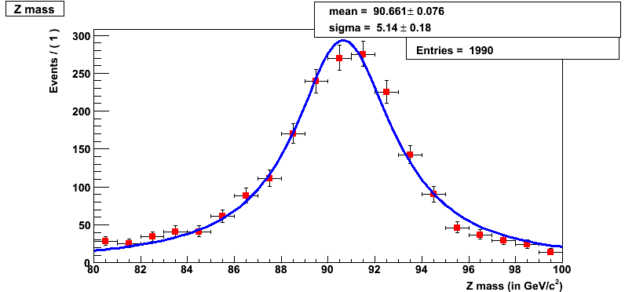
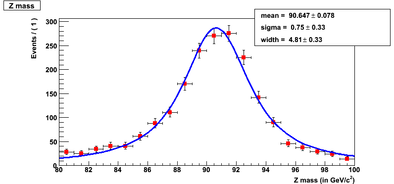

# Introduction

In this set of exercises, we will analyze the [MiniAOD][miniaod] file that was made in the [third set of exercise]({{ page.root }}). You must have this skimmed [MiniAOD][miniaod] stored locally (at T3_US_FNALLPC) in order to access them. We will use several different workflows for analyzing the [MiniAOD][miniaod], namely an EDAnalyzer, a FWLite executable, a FWLite Macro, and a FWLite PyROOT script. We will basically re-make the Z peak and few other histograms and store them in an output root file. In the exercise in the end we will try to fit with a Gaussian, Breit-Wigner function, etc.

> ## Warning
> To perform this set of exercises, an [LPC](https://twiki.cern.ch/twiki/bin/view/CMS/LPC) account, Grid Certificate, and CMS VO membership are required. You should already have these things, but if not, follow these instructions from the [setup instructions]({{ page.root }}).
{: .prereq}

> ## Note
> Please post your answers to the questions in the [Google form fourth set](https://forms.gle/vEJnfpMLxXPci4Un9).
{: .objectives}

# Exercise 15 - Analyzing MiniAOD with an EDAnalyzer

In this exercise we will analyze the skimmed [MiniAODs][miniaod] created in the [third set of exercises]({{ page.root }}) using an `EDAnalyzer`. In these skimmed [MiniAODs][miniaod], if you recall, we saved only the muons and electrons. So do not look for jets, photons, or other objects as they were simply not saved. We will use a python `config` file and an `EDAnalyzer` ( a `.cc` file) to make a Z mass peak. You can find an example list of files below, but please first try using the files you created.

> ## Example file list
> ```
> root://cmseos.fnal.gov//eos/uscms/store/user/cmsdas/2023/pre_exercises/Set4/Input/DoubleMuon/slimMiniAOD_data_MuEle_1.root
> root://cmseos.fnal.gov//eos/uscms/store/user/cmsdas/2023/pre_exercises/Set4/Input/DoubleMuon/slimMiniAOD_data_MuEle_10.root
> root://cmseos.fnal.gov//eos/uscms/store/user/cmsdas/2023/pre_exercises/Set4/Input/DoubleMuon/slimMiniAOD_data_MuEle_11.root
> root://cmseos.fnal.gov//eos/uscms/store/user/cmsdas/2023/pre_exercises/Set4/Input/DoubleMuon/slimMiniAOD_data_MuEle_12.root
> root://cmseos.fnal.gov//eos/uscms/store/user/cmsdas/2023/pre_exercises/Set4/Input/DoubleMuon/slimMiniAOD_data_MuEle_13.root
> root://cmseos.fnal.gov//eos/uscms/store/user/cmsdas/2023/pre_exercises/Set4/Input/DoubleMuon/slimMiniAOD_data_MuEle_14.root
> root://cmseos.fnal.gov//eos/uscms/store/user/cmsdas/2023/pre_exercises/Set4/Input/DoubleMuon/slimMiniAOD_data_MuEle_15.root
> root://cmseos.fnal.gov//eos/uscms/store/user/cmsdas/2023/pre_exercises/Set4/Input/DoubleMuon/slimMiniAOD_data_MuEle_16.root
> root://cmseos.fnal.gov//eos/uscms/store/user/cmsdas/2023/pre_exercises/Set4/Input/DoubleMuon/slimMiniAOD_data_MuEle_17.root
> root://cmseos.fnal.gov//eos/uscms/store/user/cmsdas/2023/pre_exercises/Set4/Input/DoubleMuon/slimMiniAOD_data_MuEle_18.root
> root://cmseos.fnal.gov//eos/uscms/store/user/cmsdas/2023/pre_exercises/Set4/Input/DoubleMuon/slimMiniAOD_data_MuEle_19.root
> root://cmseos.fnal.gov//eos/uscms/store/user/cmsdas/2023/pre_exercises/Set4/Input/DoubleMuon/slimMiniAOD_data_MuEle_2.root
> root://cmseos.fnal.gov//eos/uscms/store/user/cmsdas/2023/pre_exercises/Set4/Input/DoubleMuon/slimMiniAOD_data_MuEle_20.root
> root://cmseos.fnal.gov//eos/uscms/store/user/cmsdas/2023/pre_exercises/Set4/Input/DoubleMuon/slimMiniAOD_data_MuEle_21.root
> root://cmseos.fnal.gov//eos/uscms/store/user/cmsdas/2023/pre_exercises/Set4/Input/DoubleMuon/slimMiniAOD_data_MuEle_22.root
> root://cmseos.fnal.gov//eos/uscms/store/user/cmsdas/2023/pre_exercises/Set4/Input/DoubleMuon/slimMiniAOD_data_MuEle_23.root
> root://cmseos.fnal.gov//eos/uscms/store/user/cmsdas/2023/pre_exercises/Set4/Input/DoubleMuon/slimMiniAOD_data_MuEle_24.root
> root://cmseos.fnal.gov//eos/uscms/store/user/cmsdas/2023/pre_exercises/Set4/Input/DoubleMuon/slimMiniAOD_data_MuEle_25.root
> root://cmseos.fnal.gov//eos/uscms/store/user/cmsdas/2023/pre_exercises/Set4/Input/DoubleMuon/slimMiniAOD_data_MuEle_26.root
> root://cmseos.fnal.gov//eos/uscms/store/user/cmsdas/2023/pre_exercises/Set4/Input/DoubleMuon/slimMiniAOD_data_MuEle_27.root
> root://cmseos.fnal.gov//eos/uscms/store/user/cmsdas/2023/pre_exercises/Set4/Input/DoubleMuon/slimMiniAOD_data_MuEle_28.root
> root://cmseos.fnal.gov//eos/uscms/store/user/cmsdas/2023/pre_exercises/Set4/Input/DoubleMuon/slimMiniAOD_data_MuEle_29.root
> root://cmseos.fnal.gov//eos/uscms/store/user/cmsdas/2023/pre_exercises/Set4/Input/DoubleMuon/slimMiniAOD_data_MuEle_3.root
> root://cmseos.fnal.gov//eos/uscms/store/user/cmsdas/2023/pre_exercises/Set4/Input/DoubleMuon/slimMiniAOD_data_MuEle_30.root
> root://cmseos.fnal.gov//eos/uscms/store/user/cmsdas/2023/pre_exercises/Set4/Input/DoubleMuon/slimMiniAOD_data_MuEle_31.root
> root://cmseos.fnal.gov//eos/uscms/store/user/cmsdas/2023/pre_exercises/Set4/Input/DoubleMuon/slimMiniAOD_data_MuEle_4.root
> root://cmseos.fnal.gov//eos/uscms/store/user/cmsdas/2023/pre_exercises/Set4/Input/DoubleMuon/slimMiniAOD_data_MuEle_5.root
> root://cmseos.fnal.gov//eos/uscms/store/user/cmsdas/2023/pre_exercises/Set4/Input/DoubleMuon/slimMiniAOD_data_MuEle_6.root
> root://cmseos.fnal.gov//eos/uscms/store/user/cmsdas/2023/pre_exercises/Set4/Input/DoubleMuon/slimMiniAOD_data_MuEle_7.root
> root://cmseos.fnal.gov//eos/uscms/store/user/cmsdas/2023/pre_exercises/Set4/Input/DoubleMuon/slimMiniAOD_data_MuEle_8.root
> root://cmseos.fnal.gov//eos/uscms/store/user/cmsdas/2023/pre_exercises/Set4/Input/DoubleMuon/slimMiniAOD_data_MuEle_9.root
> ```
{: .solution}

First we will add the [PhysicsTools](https://twiki.cern.ch/twiki/bin/view/CMSPublic/SWGuidePhysicsTools)/PatExamples package as follows to `<YOURWORKINGAREA>/CMSSW_10_6_18/src`. The `PatExamples` package has lot of examples for a user to try. However, we will add our own code and config file to it and then compile. To add this package, do this:

```shell
cd $CMSSW_BASE/src/
git cms-addpkg PhysicsTools/PatExamples
```
{: .source}

> ## Note
> We are assuming that you've already checked out a CMSSW_10_6_18 release and have performed the `cmsenv` setup command.
{: .callout}

In this package, you will find the python configuration file `$CMSSW_BASE/src/PhysicsTools/PatExamples/test/analyzePatBasics_cfg.py`. You will also see the EDAnalyzer in `$CMSSW_BASE/src/PhysicsTools/PatExamples/plugins/PatBasicAnalyzer.cc`.

Next, create the following two files (download/save): [$CMSSW_BASE/src/PhysicsTools/PatExamples/src/MyZPeakAnalyzer.cc]({{ page.root }}) and [$CMSSW_BASE/src/MyZPeak_cfg.py]({{ page.root }}).

> ## Hint
> A quick way to do this on Linux, or any machine with `wget`, is by using the following commands:
> ~~~shell
> wget https://fnallpc.github.io/cms-das-pre-exercises/code/MyZPeakAnalyzer-CMSSW_10_6_18.cc -O $CMSSW_BASE/src/PhysicsTools/PatExamples/src/MyZPeakAnalyzer.cc
> wget https://fnallpc.github.io/cms-das-pre-exercises/code/MyZPeak_cfg.py -O $CMSSW_BASE/src/MyZPeak_cfg.py
> ~~~
> {: .source}
{: .callout}

Then we will compile the code that you just saved by doing:

```shell
cd $CMSSW_BASE/src/
scram b
```
{: .source}

The compilation should print many lines of text to your terminal. Among those lines you should see a line like the one below. If you can't find a similar line, then the code you just added is not compiled.

```
>> Compiling  <$CMSSW_BASE>/src/PhysicsTools/PatExamples/src/MyZPeakAnalyzer.cc
```
{: .output}

After successful compilation, you must run the config file as follows:

```shell
cmsRun MyZPeak_cfg.py
```
{: .source}

Successful running of the above config file will produce an output file `myZPeakCRAB.root`. The output file myZPeakCRAB.root has several histograms, besides the Z peak, called mumuMass, like muonMult, muonEta, muonPhi, muonPt and similarly for electrons.

> ## Note
> 
> In the case above, the file `MyZPeak_cfg`.py will read from area `root://cmseos.fnal.gov//store/user/cmsdas/2023/pre_exercises/Set4/Input/DoubleMuon/`. You should have a similar location from where you can read your [CRAB][crab] output `ROOT` files. You can edit the `MyZPeak_cfg.py` file to use the [MiniAOD][miniaod] files you made in [Exercise 13]({{ page.root }}#exercise-13---running-on-dataset-with-crab) by replacing the location of the input files to the path of file you generated"
> 
> ```
> 'root://cmseos.fnal.gov//store/user/cmsdas/2023/pre_exercises/Set4/Input/DoubleMuon/slimMiniAOD_data_MuEle_1.root', (at cmslpc) or
> 'file:/afs/cern.ch/work/d/dmoon/public/CMSDAS_Files/Exe4/slimMiniAOD_data_MuEle_1.root', (at lxplus or Bari) or
> 'file:/cmsdas/data/pre_exercises/Exe4/slimMiniAOD_data_MuEle_1.root', (at KNU) or
> 'file:/pnfs/desy.de/cms/tier2/store/user/your_username/DoubleMuon/crab_CMSDAS_Data_analysis_test0/160718_090558/0000/slimMiniAOD_data_MuEle_1.root' (at nafhh-cms)
> ```
{: .callout}

> ## Question 15
> What is the number of entries in the `mumuMass` plot if you just used the first input file, probably named `slimMiniAOD_data_MuEle_1.root`?
{: .challenge}

# Exercise 16 - Analyzing MiniAOD with an FWLite executable

In this exercise we will make the same `ROOT` file, `myZPeakCRAB.root`, as in [Exercise 15](#exercise-15---analyzing-miniaod-with-an-edanalyzer), but we call it myZPeakCRAB_fwlite.root so that you do not end up overwriting the file previously made in [Exercise 15](#exercise-15---analyzing-miniaod-with-an-edanalyzer).

First, check out the following two packages by doing:

```shell
cd $CMSSW_BASE/src/
git cms-addpkg PhysicsTools/FWLite
git cms-addpkg PhysicsTools/UtilAlgos
```
{: .source}

Next, replace the existing `$CMSSW_BASE/src/PhysicsTools/FWLite/bin/FWLiteWithPythonConfig.cc` with this [FWLiteWithPythonConfig.cc]({{ page.root }}). You are simply updating an existing analyzer. Then, create the file [$CMSSW_BASE/src/parameters.py]({{ page.root }}).

> ## Hint
> You can easily download the needed files by running the following commands:
> ~~~shell
> wget https://fnallpc.github.io/cms-das-pre-exercises/code/FWLiteWithPythonConfig.cc -O $CMSSW_BASE/src/PhysicsTools/FWLite/bin/FWLiteWithPythonConfig.cc
> wget https://fnallpc.github.io/cms-das-pre-exercises/code/parameters.py -O $CMSSW_BASE/src/parameters.py
> ~~~
> {: . source}
{: .callout}

> ## Note
> In case you have completed [Exercise Set 3]({{ page.root }}) successfully, put the names and path of the `ROOT` files that you made yourself via submitting CRAB job, instead of those currently in `parameters.py`.
> 
> `parameters.py` will read from area `root://cmseos.fnal.gov//store/user/cmsdas/2023/pre_exercises/Set4/Input/DoubleMuon/`. You should have a similar location from where you can read your [CRAB][crab] output `ROOT` files. You can edit the `parameters.py` file to use the [MiniAOD][miniaod] files you made in [Exercise 13]({{ page.root }}#exercise-13---running-on-dataset-with-crab) by replacing the location of the input files:
> ```
> 'root://cmseos.fnal.gov//store/user/cmsdas/2023/pre_exercises/Set4/Input/DoubleMuon/slimMiniAOD_data_MuEle_1.root', (at cmslpc)
> 'file:/afs/cern.ch/work/d/dmoon/public/CMSDAS_Files/Exe4/slimMiniAOD_data_MuEle_1.root', (at lxplus or Bari) or
> 'file:/cmsdas/data/pre_exercises/Exe4/slimMiniAOD_data_MuEle_1.root', (at KNU) or
> 'file:/pnfs/desy.de/cms/tier2/store/user/your_username/DoubleMuon/crab_CMSDAS_Data_analysis_test0/160718_090558/0000/slimMiniAOD_data_MuEle_1.root' (at nafhh-cms)
> ```
{: .callout}

Then we will compile the code that you just saved by doing:

```shell
cd $CMSSW_BASE/src/
scram b -j 4
```
{: .source}

You should see among the output a line like the one below. If not, it is probable that you haven't compiled the code on which we are working.

```
>> Compiling  /your_path/YOURWORKINGAREA/CMSSW_10_6_18/src/PhysicsTools/FWLite/bin/FWLiteWithPythonConfig.cc
```
{: .output}

After successful compilation, you must run the config file as follows:

```shell
cd $CMSSW_BASE/src/
cmsenv
FWLiteWithPythonConfig parameters.py
```
{: .source}

> ## Note
> Take note of the extra `cmsenv` is to ensure the changes to files in the `bin` subdirectory are picked up in your path.
{: .callout}

> You might get a segfault when running this exercise. Just ignore it; the output `ROOT` file will still be created and be readable.
{: .warning}

> ## Note
> Take a look at how the parameters defined in `parameters.py` get input to the executable code `FWLiteWithPythonConfig.cc`.
{: .callout}

A successful running of the FWLite executable, `FWLiteWithPythonConfig`, results in an output file called `myZPeakCRAB_fwlite.root`.

The output `ROOT` file `myZPeakCRAB_fwlite.root` is a bit different from `myZPeakCRAB.root` made in [Exercise 15](#exercise-15---analyzing-miniaod-with-an-edanalyzer) since we did not make any of the electron histograms. The histograms do have the `mumuMass`, besides, `muonEta`, `muonPhi`, and `muonPt`.

> ## Question 16
> What is the number in entries in the `mumuMass` obtained in [Exercise 16](#exercise-16---analyzing-miniaod-with-an-fwlite-executable), again using only the first input file.?
{: .challenge}

# Exercise 17 - Fitting the Z mass peak

The main intention of fitting the Z mass peak is to show how to fit a distribution. To do this exercise, you will need the `ROOT` files that you made in [Exercise 15](#exercise-15---analyzing-miniaod-with-an-edanalyzer) and [Exercise 16](#exercise-16---analyzing-miniaod-with-an-fwlite-executable). Make sure you have the `ROOT` file `$CMSSW_BASE/src/myZPeakCRAB.root` ( [Exercise 15](#exercise-15---analyzing-miniaod-with-an-edanalyzer)) or `myZPeakCRAB_fwlite.root` ([Exercise 16](#exercise-16---analyzing-miniaod-with-an-fwlite-executable)). If you have not managed to create at least one of these `ROOT` files, you can get them from the following locations:

> ## File list
> ```
> root://cmseos.fnal.gov//store/user/cmsdas/2023/pre_exercises/Set4/Output/myZPeakCRAB.root # cmslpc
> root://cmseos.fnal.gov//store/user/cmsdas/2023/pre_exercises/Set4/Output/myZPeakCRAB_fwlite.root # cmslpc
> /afs/cern.ch/cms/Tutorials/TWIKI_DATA/CMSDataAnaSch/myZPeakCRAB.root # lxplus or Bari
> ```
{: .solution}

This will allow you to continue with [Exercise 17](#exercise-17---fitting-the-z-mass-peak). For this exercise, we will use the `ROOT` file `myZPeakCRAB.root`. Alternatively, you can use the file `myZPeakCRAB_fwlite.root`, but just make sure to have the right name of the `ROOT` file. The most important factor is that both of these files have the histogram `mumuMass`.

We also ask that you create a [rootlogon.C]({{ page.root }}) file in the `$CMSSW_BASE/src/` directory. We will reference this version as opposed to anyone's personalized rootlogon file. This sets up the libraries needed to complete this exercise. 

The different distribution that we would fit to the Z mass peak are:

 - Gaussian


<!-- For GitLab Flavored Markdown
```math
  \begin{displaymath}
   G(x; \mu, \sigma) = \frac{1}{\sqrt{2\pi}\sigma}\exp\left[-\frac{(x-\mu)^2}{2\sigma^2}\right]
  \end{displaymath}
```
-->

 - Relativistic Breit-Wigner


<!-- For GitLab Flavored Markdown
```math
  \begin{displaymath}
   B(m; M, \Gamma) = N \cdot \frac{2}{\pi} \cdot \frac{\Gamma^{2}M^{2}}{(m^{2}-M^{2})^{2}+m^{4}(\Gamma^{2}/M^{2})}
  \end{displaymath}
```
-->

 - Convolution of relativistic Breit-Wigner plus interference term with a Gaussian


<!-- For GitLab Flavored Markdown
```math
  \begin{displaymath}
   P(m) = \int B(m'; M, \Gamma)\cdot G(m-m'; \mu, \sigma) dm'  
  \end{displaymath}
```
-->

> ## Some general remarks about fitting a Z peak
> To fit a generator-level Z peak, a Breit-Wigner fit makes sense. However, reconstructed-level Z peaks have many detector resolutions that smear the Z mass peak. If the detector resolution is relatively poor, then it is usually good enough to fit a Gaussian (since the gaussian detector resolution will overwhelm the inherent Briet-Wigner shape of the peak). If the detector resolution is fairly good, then another option is to fit a Breit-Wigner (for the inherent shape) convolved with a Gaussian (to describe the detector effects). This is in the "no-background" case. If you have backgrounds in your sample (Drell-Yan, cosmics, etc...), and you want to do the fit over a large mass range, then another function needs to be included to take care of this; an exponential is commonly used.
{: .callout}

## Fitting a Gaussian

There are several options to fit a Gaussian

### Using the inbuilt Gaussian in ROOT

Open `ROOT` as follows:

```shell
root -l
```
{: .source}

Then execute the following commands:

```
TFile f("myZPeakCRAB.root");
f.cd("analyzeBasicPat");
gStyle->SetOptFit(111111);   
mumuMass->Fit("gaus");
```
{: .source}

This will pop up the following histogram. Save this histogram as `pdf`, `ps`, or `eps` file using the menu of the histogram window. As you can see we should fit a sub-range as this fit is not a good fit. In the next part of this exercise, we will fit a sub-range of the `mumuMass` distribution, but for this we will use a `ROOT` macro as using inbuilt `ROOT` functions have very minimal usage. For more complex or useful fitting functions, one has to use a macro.

For now, we can improve the fit description of the Z resonance by limiting our fit range:

```
TFile f("myZPeakCRAB.root");
f.cd("analyzeBasicPat");
gStyle->SetOptFit(111111);   
g1 = new TF1("m1","gaus",85,95);
mumuMass->Fit(g1,"R");
```
{: .source}

One should obtain a similar histogram as:



> ## Reminder
> You can quit `ROOT` using the `.q` command.
{: .callout}

The line `gStyle->SetOptFit(111111);`` enables all the histogram statistics to be displayed. For more options and other information please refer to [ROOT documentation][root].

> ## Question 17.1a
> What is the value of the mean Z Mass that you get?
{: .challenge}

> ## Question 17.1b
> What is the value of the chisquare/ndf that you get?
{: .challenge}

### Using a macro of your own in ROOT

As you have seen above, we should fit a sub-range of the Z mass distribution because the fit in the full range is not all that great. In this exercise, we will fit a sub-range of the `mumuMass` distribution but for this we will use a `ROOT` macro. For more complex or useful fitting functions, one has to use a macro. The macro to run is [FitZPeak.C]({{ page.root }}). This macro calls another macro, [BW.C]({{ page.root }}). Please download/save them with the corresponding names in `$CMSSW_BASE/src`. Note that now the `myZPeakCRAB.root` file is opened by executing the macro itself, in addition to fitting the Z mass peak.

To run this macro execute the following command from the `$CMSSW_BASE/src` directory:

```shell
root -l FitZPeak.C
```
{: .source}

This should pop up a histogram (shown below) and you will find yourself in a `ROOT` session.



> ## Reminder
> You can save this plot from the menu on top of the histogram and then quit `ROOT` using the `.q` command.
{: .callout}

> ## Hint
> You can also save the plot to an encapsulated postscript file by running the macro as:
> ~~~shell
> root -l FitZPeak.C\(true\)
> ~~~
> {: .source}
{: .callout}

Here is some explanation of the macro. We have defined the Gaussian distribution that we want to fit in the macro `BW.C` (shown below). Note that in the same macro we have also is defined a Breit-Wigner function that you can try yourself. However, in the later part of the exercise, we will use `RooFit` to fit the distribution using a Breit-Wigner function.

```c++
Double_t mygauss(Double_t * x, Double_t * par)
{
  Double_t arg = 0;
  if (par[2]<0) par[2]=-par[2];  // par[2]: sigma
  if (par[2] != 0) arg = (x[0] - par[1])/par[2];  // par[1]: mean
 
 //return par[0]*BIN_SIZE*TMath::Exp(-0.5*arg*arg)/
  //   (TMath::Sqrt(2*TMath::Pi())*par[2]); 
   return par[0]*TMath::Exp(-0.5*arg*arg)/
     (TMath::Sqrt(2*TMath::Pi())*par[2]); // par[0] is constant
 
}
```
{: .source}

`par[0]`, `par[1]`, and `par[2]` are the `constant`, `mean`, and `sigma` parameters, respectively. Also `x[0]` mean the x-axis variable. `BW.C` is called by `FitZPeak.C` in the line `gROOT->LoadMacro("BW.C");`. The initial values of the three fitted parameters are defined in `FitZPeak.C` as follows:

```c++
func->SetParameter(0,1.0);   func->SetParName(0,"const");  
func->SetParameter(2,5.0);   func->SetParName(2,"sigma");  
func->SetParameter(1,95.0);     func->SetParName(1,"mean");
```
{: .source}

Also note that in the macro `FitZPeak.C`, we have commented the following lines and used the two lines below it. The reason being that we want to fit a sub-range. If you would want to fit the entire range of the histogram, get the minimum and maximum value of the range by instead using the lines that have been commented.

```c++
//float massMIN = Z_mass->GetBinLowEdge(1);
//float massMAX = Z_mass->GetBinLowEdge(Z_mass->GetNbinsX()+1);

float massMIN = 85.0;
float massMAX = 96.0;
```
{: .source}

> ## Question 17.2
> What mean value of the Z mass do you get in the fitted sub-range?
{: .challenge}

### Using a macro in RooFit

Before we start, have a look at the [RooFit twiki](https://twiki.cern.ch/twiki/bin/view/CMS/RooFit) to get a feeling for it. Then save the macro [RooFitMacro.C]({{ page.root }}) in the `$CMSSW_BASE/src/` directory. This macro will fit the Z mass peak using `RooFit`.

Take a look at the code and then execute the following:

```shell
root -l RooFitMacro.C
```
{: .source}

You may need to add the following line to your `rootlogon.C` file to get this interpreted code to work:

```c++
gROOT->ProcessLine(".include $ROOFITSYS/include/");
```
{: .source}

This should pop a histogram (shown below) and you will find yourself in a `ROOT` session.

> ## Reminder
> You can save this plot from the menu on top of the histogram and then quit `ROOT` using the `.q` command.
{: .callout}

We fit the distribution with a Gaussian by default. However, we can fit a Breit-Wigner or Voigtian (convolution of Breit-Wigner and Gaussian) by uncommenting the appropriate lines.



> ## Question 17.3a
> What is the mean for the gaussian fit in RooFit?
{: .challenge}

> ## Question 17.3b
> What is the sigma for the gaussian fit in RooFit?
{: .challenge}

## Fitting a Breit-Wigner

### Using a macro in ROOT

To fit the Z mass peak using a Breit-Wigner distribution, we first uncomment the Breit-Wigner part of `FitZPeak.C` and comment out the Gaussian part as follows (using `/*` and `*/`):

```c++
////////////////
//For Gaussian//
///////////////
/*
TF1 *func = new TF1("mygauss",mygauss,massMIN, massMAX,3); 
func->SetParameter(0,1.0);   func->SetParName(0,"const");  
func->SetParameter(2,5.0);   func->SetParName(2,"sigma");  
func->SetParameter(1,95.0);     func->SetParName(1,"mean");

Z_mass->Fit("mygauss","QR");
TF1 *fit = Z_mass->GetFunction("mygauss");
*/
/////////////////////
// For Breit-Wigner//
////////////////////
TF1 *func = new TF1("mybw",mybw,massMIN, massMAX,3);
func->SetParameter(0,1.0);   func->SetParName(0,"const");
func->SetParameter(2,5.0);     func->SetParName(1,"sigma");
func->SetParameter(1,95.0);    func->SetParName(2,"mean");

Z_mass->Fit("mybw","QR");
TF1 *fit = Z_mass->GetFunction("mybw");
```
{: .source}

Then execute the following:

```shell
root -l FitZPeak.C
```
{: .source}

This should pop a histogram (shown below) and you will find yourself in `ROOT` seession.



> ## Reminder
> You can save this plot from the menu on top of the histogram and then quit `ROOT` using the `.q` command.
{: .callout}

> ## Question 17.4a
> What is the mean for the Breit-Wigner fit using the macro?
{: .challenge}

> ## Question 17.4b
> What is the sigma for Breit-Wigner fit using the macro?
{: .challenge}

### Using a macro in RooFit

Before we proceed we need to uncomment and comment out few lines in `RooFitMacro.C` to have them look as follows:

```c++
//RooGaussian gauss("gauss","gauss",x,mean,sigma);
RooBreitWigner gauss("gauss","gauss",x,mean,sigma);
// RooVoigtian gauss("gauss","gauss",x,mean,width,sigma);
```
{: .source}

Then execute:

```shell
root -l RooFitMacro.C
```
{: .source}

This should pop a histogram (shown below) as follows and you will find yourself in `ROOT` session.



> ## Reminder
> You can save this plot from the menu on top of the histogram and then quit `ROOT` using the `.q` command.
{: .callout}

> ## Question 17.5a
> What is the mean for the Breit-Wigner fit using [RooFit](https://twiki.cern.ch/twiki/bin/view/CMS/RooFit) tool?
{: .challenge}

> ## Question 17.5b
> What is the sigma for the Breit-Wigner fit using [RooFit](https://twiki.cern.ch/twiki/bin/view/CMS/RooFit) tool?
{: .challenge}

## Fitting a Convolution of Gaussian and Breit-Wigner

### Using a macro in RooFit

Before we proceed we need to uncomment and comment out few lines in `RooFitMacro.C` to have them look as follows:

```c++
//RooGaussian gauss("gauss","gauss",x,mean,sigma);
// RooBreitWigner gauss("gauss","gauss",x,mean,sigma);
RooVoigtian gauss("gauss","gauss",x,mean,width,sigma);
```
{: .source}

Then execute:

```shell
root -l RooFitMacro.C
```
{: .source}

This should pop a histogram (shown below) as follows and you will find yourself in `ROOT` seession.



> ## Reminder
> You can save this plot from the menu on top of the histogram and then quit `ROOT` using the `.q` command.
{: .callout}

> ## Question 17.6a
> What is the mean for the convolved fit using [RooFit](https://twiki.cern.ch/twiki/bin/view/CMS/RooFit) tool?
{: .challenge}

> ## Question 17.6b
> What is the sigma for the convolved fit using [RooFit](https://twiki.cern.ch/twiki/bin/view/CMS/RooFit) tool?
{: .challenge}


