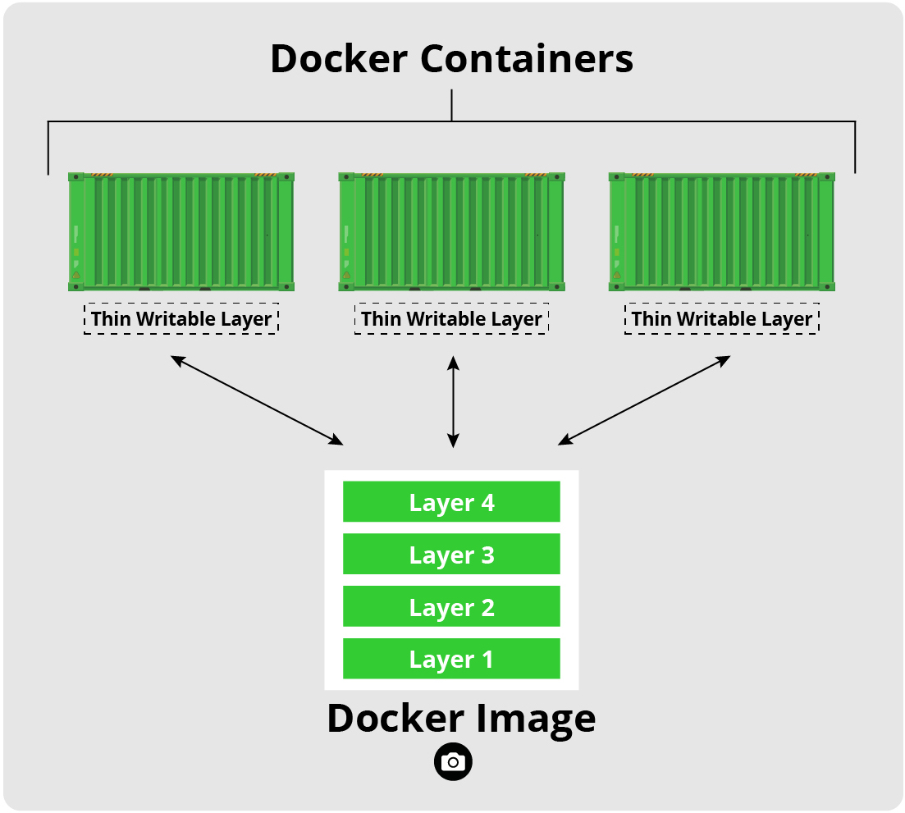

# Introduction

> ## Warning
> As a prerequisite for this exercise, please make sure that you have correctly followed the [setup instructions]({{ page.root }}) for installing [Docker][docker] and obtaining a [DockerHub][docker-hub] account.
{: .prereq}

> ## Note
> Please post your answers to the questions in the [online response form](https://forms.gle/v6Fyeim8GYVCLCws9).
{: .objectives}

> ## Limitation
> This exercise seeks to introduce the student to the benefits of containerization and a handful of container services. We cannot cover all topics related to containerization in this short exercise. In particular, we do not seek to explain what is happening under the hood or how to develop your own images. There are other great tutorials covering a variety of containerization topics as they relate to LHC experiments:
> - [Docker/Singularity HATS@LPC](https://awesome-workshop.github.io/docker-singularity-hats/index.html)
> - [Introduction to Docker](https://awesome-workshop.github.io/intro-to-docker/)
> - [Software containers for CMSSW](https://awesome-workshop.github.io/docker-cms/)
> - [Official Docker documentation and tutorial][docker-tutorial]
> 
> There are undoubtedly also other, non-LHC oriented tutorials online.
{: .caution}

## Containers and Images

Containers are like lightweight virtual machines. They behave as if they were their own complete OS, but actually only contain the components necessary to operate. Instead, containers share the host machine's system kernel, significantly reducing their size. In essence, they run a second OS natively on the host machine with just a thin additional layer, which means they can be faster than traditional virtual machines. These container only take up as much memory as necessary, which allows many of them to be run simultaneously and they can be spun up quite rapidly.

 

Images are read-only templates that contain a set of instructions for creating a container. Different container orchestration programs have different formats for these images. Often a single image is made of several files (layers) which contain all of the dependencies and application code necessary to create and configure the container environment. In other words, [Docker containers][docker-containers] are the runtime instances of images &mdash; they
are images with a state.

This allows us to package up an application with just the dependencies we need (OS and libraries) and then deploy that image as a single package. This allows us to:
1. replicate our environment/workflow on other host machines
2. run a program on a host OS other than the one for which is was designed (**not 100% foolproof**)
3. sandbox our applications in a secure environment (**still important to take proper safety measures**)

## Container Runtimes

For the purposes of this tutorial we will only be considering [Docker][docker] and [Singularity][singularity] for container runtimes. That said, these are really powerful tools which are so much more than just container runtimes. We encourage you to take the time to explore the [Docker][docker-docs] and [Singularity][singularity-docs] documentation.

    
    

                

> ## Side Note
> As a side note, Docker has very similar syntax to Git and Linux, so if you are familiar
with the command line tools for them then most of Docker should seem somewhat natural
(though you should still read the docs!).
{: .callout}

# Exercise 20 - Pulling Docker Images

Much like [GitHub][github] allows for web hosting and searching for code, the image registries allow the same for Docker/Singularity images. Without going into too much detail, there are several public and private registries available. For Docker, however, the defacto default registry is [Docker Hub][docker-hub]. Singularity, on the other hand, does not have a defacto default registry.

To begin with we're going to [pull][docker-docs-pull] down the Docker image we're going to be working in for this part of the tutorial (**Note:** If you already did the `docker pull`, this image will already be on your machine. In this case, Docker should notice it's there and not attempt to re-pull it, unless the image has changed in the meantime.):

~~~shell
docker pull sl

#if you run into a premission error, use "sudo docker run ..." as a quick fix
# to fix this for the future, see https://docs.docker.com/install/linux/linux-postinstall/
~~~
{: .source}

~~~
Using default tag: latest
latest: Pulling from library/sl
32cc6c378ee5: Pull complete
Digest: sha256:6cc5f47d16bd74ea8a2c3f68ead5ee893c032ccd75269d6d714cb34fc2153cb7
Status: Downloaded newer image for sl:latest
docker.io/library/sl:latest
~~~
{: .output}

The image names are composed of `NAME[:TAG|@DIGEST]`, where the `NAME` is composed of `REGISTRY-URL/NAMESPACE/IMAGE` and is often referred to as a *repository*. Here are some things to know about specifying the image:
* Some repositories will include a `USERNAME` as part of the image name (i.e. `fnallpc/fnallpc-docker`), and others, usually Docker verified content, will include only a single name (i.e. `sl`).
* A registry path (`REGISTRY-URL/NAMESPACE`) is similar to a URL, but does not contain a protocol specifier (https://). Docker uses the https:// protocol to communicate with a registry, unless the registry is allowed to be accessed over an insecure connection. Registry credentials are managed by docker login. If no registry path is given, the docker daemon assumes you meant to pull from Docker Hub and automatically appends `docker.io/library` to the beginning of the image name.
* If no tag is provided, Docker Engine uses the `:latest` tag as a default.
* The SHA256 `DIGEST` is much like a Git hash, where it allows you to pull a specific version of an image. 
* CERN GitLab's repository path is `gitlab-registry.cern.ch/<username>/<repository>/<image_name>[:<tag>|@<digest>]`.

Now, let's [list the images][docker-docs-images] that we have available to us locally

~~~shell
docker images
~~~
{: .source}

If you have many images and want to get information on a particular one you can apply a filter, such as the repository name

~~~shell
docker images sl
~~~
{: .source}

~~~
REPOSITORY          TAG                 IMAGE ID            CREATED             SIZE
sl                  latest              dddf32954161        3 weeks ago         177MB
~~~
{: .output}

or more explicitly

~~~shell
docker images --filter=reference="sl"
~~~
{: .source}

~~~
REPOSITORY          TAG                 IMAGE ID            CREATED             SIZE
sl                  latest              dddf32954161        3 weeks ago         177MB
~~~
{: .output}

You can see here that there is the `TAG` field associated with the
`sl` image.
Tags are way of further specifying different versions of the same image.
As an example, let's pull the `7` release tag of the
[sl image](https://hub.docker.com/_/sl) (again, if it was already pulled during setup, docker won't attempt to re-pull it unless it's changed since last pulled).

~~~shell
docker pull sl:7
docker images sl
~~~
{: .source}

~~~
7: Pulling from library/sl
Digest: sha256:6cc5f47d16bd74ea8a2c3f68ead5ee893c032ccd75269d6d714cb34fc2153cb7
Status: Downloaded newer image for sl:7
docker.io/library/sl:7

REPOSITORY          TAG                 IMAGE ID            CREATED             SIZE
sl                  7                   dddf32954161        3 weeks ago         177MB
sl                  latest              dddf32954161        3 weeks ago         177MB
~~~
{: .output}

> ## Question 20.1
> Pull down the `python:3.7-slim` image and then list all of the `python` images along with the `sl:7` image. What is the 'Image ID' of the `python:3.7-slim` image? Try to do this without looking at the solution.
> 
> > ## Solution
> >
> > ~~~bash
> > docker pull python:3.7-slim
> > docker images --filter=reference="sl" --filter=reference="python"
> > ~~~
> > {: .source}
> >
> > ~~~
> > 3.7-slim: Pulling from library/python
d121f8d1c412: Pull complete
ca572574cc82: Pull complete
2bec6349c99d: Pull complete
087ac0b72728: Pull complete
6ca52d7c92b3: Pull complete
Digest: sha256:e787b48ee93cad4d7157e13c01c109650ddad8f622fab6644ab5dd700eacae64
Status: Downloaded newer image for python:3.7-slim
docker.io/library/python:3.7-slim
> > 
> > REPOSITORY          TAG                 IMAGE ID            CREATED             SIZE
> > python              3.7-slim            4d4a9832278b        2 weeks ago         112MB
> > sl                  7                   dddf32954161        3 weeks ago         177MB
> > sl                  latest              dddf32954161        3 weeks ago         177MB
> > ~~~
> > {: .output}
> {: .solution}
{: .challenge}

# Exercise 21 - Running Docker Images

To use a Docker image as a particular instance on a host machine you [run][docker-docs-run] it as a container. You can run in either a [detached or foreground][docker-docs-run-detached] (interactive) mode.

Run the image we pulled as a container with an interactive bash terminal:

~~~shell
docker run -it sl:7 /bin/bash
~~~
{: .source}

The `-i` option here enables the interactive session, the `-t` option gives access to a terminal and the `/bin/bash` command makes the container start up in a bash session. 

You are now inside the container in an interactive bash session. Check the file directory

~~~shell
pwd
ls -alh
~~~
{: .source}

> ## Output
> ~~~
> /
> total 56K
> drwxr-xr-x   1 root root 4.0K Sep 25 08:26 .
> drwxr-xr-x   1 root root 4.0K Sep 25 08:26 ..
> -rwxr-xr-x   1 root root    0 Sep 25 08:26 .dockerenv
> lrwxrwxrwx   1 root root    7 Sep  1 13:06 bin -> usr/bin
> dr-xr-xr-x   2 root root 4.0K Apr 12  2018 boot
> drwxr-xr-x   5 root root  360 Sep 25 08:26 dev
> drwxr-xr-x   1 root root 4.0K Sep 25 08:26 etc
> drwxr-xr-x   2 root root 4.0K Sep  1 13:07 home
> lrwxrwxrwx   1 root root    7 Sep  1 13:06 lib -> usr/lib
> lrwxrwxrwx   1 root root    9 Sep  1 13:06 lib64 -> usr/lib64
> drwxr-xr-x   2 root root 4.0K Apr 12  2018 media
> drwxr-xr-x   2 root root 4.0K Apr 12  2018 mnt
> drwxr-xr-x   2 root root 4.0K Apr 12  2018 opt
> dr-xr-xr-x 210 root root    0 Sep 25 08:26 proc
> dr-xr-x---   2 root root 4.0K Sep  1 13:07 root
> drwxr-xr-x  11 root root 4.0K Sep  1 13:07 run
> lrwxrwxrwx   1 root root    8 Sep  1 13:06 sbin -> usr/sbin
> drwxr-xr-x   2 root root 4.0K Apr 12  2018 srv
> dr-xr-xr-x  12 root root    0 Sep 23 04:12 sys
> drwxrwxrwt   2 root root 4.0K Sep  1 13:07 tmp
> drwxr-xr-x  13 root root 4.0K Sep  1 13:06 usr
> drwxr-xr-x  18 root root 4.0K Sep  1 13:07 var
> ~~~
{: .solution}

and check the host to see that you are not in your local host system

~~~shell
hostname
~~~
{: .source}

~~~
<generated hostname>
~~~
{: .output}

> ## Question 21.1
> Check the `/etc/os-release` file to see that you are actually inside a release of Scientific Linux. What is the Version ID of this SL image? Try to do this without looking at the solution.
> 
> > ## Solution
> > ~~~shell
> > cat /etc/os-release
> > ~~~
> > {: .source}
> > 
> > ~~~
> > NAME="Scientific Linux"
> > VERSION="7.8 (Nitrogen)"
> > ID="scientific"
> > ID_LIKE="rhel centos fedora"
> > VERSION_ID="7.8"
> > PRETTY_NAME="Scientific Linux 7.8 (Nitrogen)"
> > ANSI_COLOR="0;31"
> > CPE_NAME="cpe:/o:scientificlinux:scientificlinux:7.8:GA"
> > HOME_URL="http://www.scientificlinux.org//"
> > BUG_REPORT_URL="mailto:scientific-linux-devel@listserv.fnal.gov"
> > 
> > REDHAT_BUGZILLA_PRODUCT="Scientific Linux 7"
> > REDHAT_BUGZILLA_PRODUCT_VERSION=7.8
> > REDHAT_SUPPORT_PRODUCT="Scientific Linux"
> > REDHAT_SUPPORT_PRODUCT_VERSION="7.8"
> > ~~~
> > {: .output}
> {: .solution}
{: .challenge}

# Exercise 22 - Monitoring, Exiting, Restarting, and Stopping Containers

## Monitoring You Containers

Open up a new terminal tab on the host machine and
[list the containers that are currently running][docker-docs-ps]

~~~shell
docker ps
~~~
{: .source}

~~~
CONTAINER ID        IMAGE         COMMAND             CREATED             STATUS              PORTS               NAMES
<generated id>      <image:tag>   "/bin/bash"         n minutes ago       Up n minutes                            <generated name>
~~~
{: .output}

Notice that the name of your container is some randomly generated name.
To make the name more helpful, [rename][docker-docs-rename] the running container

~~~shell
docker rename <CONTAINER ID> my-example
~~~
{: .source}

and then verify it has been renamed

~~~shell
docker ps
~~~
{: .source}

~~~
CONTAINER ID        IMAGE         COMMAND             CREATED             STATUS              PORTS               NAMES
<generated id>      <image:tag>   "/bin/bash"         n minutes ago       Up n minutes                            my-example
~~~
{: .output}

> ## Specifying a name
> 
> You can also startup a container with a specific name
> 
> ~~~shell
> docker run -it --name my-example sl:7 /bin/bash
> ~~~
>{: .source}
{: .callout}

# Exiting a Container

As a test, go back into the terminal used for your container, and create a file in the container

~~~shell
touch test.txt
~~~
{: .source}

In the container exit at the command line

~~~shell
exit
~~~
{: .source}

You are returned to your shell.
If you list the containers you will notice that none are running

~~~shell
docker ps
~~~
{: .source}

~~~
CONTAINER ID        IMAGE               COMMAND             CREATED             STATUS              PORTS               NAMES
~~~
{: .output}

but you can see all containers that have been run and not removed with

~~~shell
docker ps -a
~~~
{: .source}

~~~
CONTAINER ID        IMAGE         COMMAND             CREATED            STATUS                     PORTS               NAMES
<generated id>      <image:tag>   "/bin/bash"         n minutes ago      Exited (0) t seconds ago                       my-example
~~~
{: .output}

## Restating a Container

To restart your exited Docker container [start][docker-docs-start] it again and then [attach][docker-docs-attach] it interactively to your shell

~~~shell
docker start <CONTAINER ID>
docker attach <CONTAINER ID>
~~~
{: .source}

> ## `exec` command
> The [attach][docker-docs-attach] command used here is a handy shortcut to interactively access a running container with the same start command (in this case `/bin/bash`) that it was originally run with. 
>
> In case you'd like some more flexibility, the [exec][docker-docs-exec] command lets you run any command in the container, with options similar to the run command to enable an interactive (`-i`) session, etc. 
>
> For example, the `exec` equivalent to `attach`ing in our case would look like:
> ~~~bash
> docker start <CONTAINER ID>
> docker exec -it <CONTAINER ID> /bin/bash
> ~~~
> 
> You can start multiple shells inside the same container using `exec`.
{: .callout}

Notice that your entry point is still `/` and then check that your
`test.txt` still exists

~~~shell
ls -alh test.txt
~~~
{: .source}

~~~
-rw-r--r-- 1 root root 0 Sep 25 08:39 test.txt
~~~
{: .output}

> ## Clean up a container
>
> If you want a container to be [cleaned up][docker-docs-run-clean-up] &mdash; that is deleted &mdash; after you exit it then run with the `--rm` option flag
>
> ~~~bash
> docker run --rm -it <IMAGE> /bin/bash
> ~~~
> {: .source}
{: .callout}

## Stopping a Container

Sometimes you will exited a container and it won't stop. Other times your container may crash or enter a bad state, but still be running. In order to stop a container you will exit it (`exit`) and then enter:

~~~shell
docker stop <CONTAINER ID> # or <NAME>
~~~
{: .source}

# Exercise 23 - Removing Containers and Images

You can cleanup/remove a container [`docker rm`][docker-docs-rm]
~~~shell
docker rm <CONTAINER NAME>
~~~
{: .source}

**Note:** A container must be stopped in order for it to be removed.

Start an instance of the `sl:latest` container, exit it, and then remove it:

~~~shell
docker run sl:latest
docker ps -a
docker rm <CONTAINER NAME>
docker ps -a
~~~
{: .source}

> ## Output
> ~~~
> CONTAINER ID        IMAGE         COMMAND             CREATED            STATUS                     PORTS               NAMES
> <generated id>      <image:tag>   "/bin/bash"         n seconds ago      Exited (0) t seconds ago                       <name>
> 
> <generated id>
> 
> CONTAINER ID        IMAGE         COMMAND             CREATED            STATUS                     PORTS               NAMES
> ~~~
{: .solution}

You can remove an image from your computer entirely with [`docker rmi`][docker-docs-rmi]
~~~shell
docker rmi <IMAGE ID>
~~~
{: .source}

> ## Question 23.1
>
> Pull down the Python 2.7 image (2.7-slim tag) from Docker Hub and then delete it. What was the image ID for the `python:2.7-slim` images? Try not to look at the solution.
>
> > ## Solution
> >
> > ~~~shell
> > docker pull python:2.7-slim
> > docker images python
> > docker rmi <IMAGE ID>
> > docker images python
> > ~~~
> > {: .source}
> >
> > ~~~
> >2.7: Pulling from library/python
> ><some numbers>: Pull complete
> ><some numbers>: Pull complete
> ><some numbers>: Pull complete
> ><some numbers>: Pull complete
> ><some numbers>: Pull complete
> ><some numbers>: Pull complete
> ><some numbers>: Pull complete
> ><some numbers>: Pull complete
> >Digest: sha256:<the relevant SHA hash>
> >Status: Downloaded newer image for python:2.7-slim
> >docker.io/library/python:2.7-slim
> >
> >REPOSITORY          TAG                 IMAGE ID            CREATED             SIZE
> >python              2.7-slim            d75b4eed9ada        14 hours ago        886MB
> >python              3.7-slim            e440e2151380        23 hours ago        918MB
> >
> >Untagged: python@sha256:<the relevant SHA hash>
> >Deleted: sha256:<layer SHA hash>
> >Deleted: sha256:<layer SHA hash>
> >Deleted: sha256:<layer SHA hash>
> >Deleted: sha256:<layer SHA hash>
> >Deleted: sha256:<layer SHA hash>
> >Deleted: sha256:<layer SHA hash>
> >Deleted: sha256:<layer SHA hash>
> >Deleted: sha256:<layer SHA hash>
> >Deleted: sha256:<layer SHA hash>
> >Deleted: sha256:<layer SHA hash>
> >
> >REPOSITORY          TAG                 IMAGE ID            CREATED             SIZE
> >python              3.7-slim            e440e2151380        23 hours ago        918MB
> > ~~~
> > {: .output}
> {: .solution}
{: .challenge}

# Exercise 24 - File I/O with Containers

## Copying Files To and From a Container

[Copying][docker-docs-cp] files between the local host and Docker containers is possible. On your local host find a file that you want to transfer to the container and then

~~~shell
touch io_example.txt
# If on Mac need to do: chmod a+w io_example.txt
echo "This was written on local host" > io_example.txt
docker cp io_example.txt <NAME>:<remote path>
~~~
{: .source}

**Note:** Remember to do `docker ps` if you don't know the name of your container.

From the container check and modify the file in some way

~~~shell
pwd
ls
cat io_example.txt
echo "This was written inside Docker" >> io_example.txt
~~~
{: .source}

~~~
<remote path>
io_example.txt
This was written on local host
~~~
{: .output}

and then on the local host copy the file out of the container

~~~shell
docker cp <NAME>:<remote path>/io_example.txt .
~~~
{: .source}

and verify if you want that the file has been modified as you wanted

~~~shell
cat io_example.txt
~~~
{: .source}

~~~
This was written on local host
This was written inside Docker
~~~
{: .output}

## Volume Mounting

What is more common and arguably more useful is to [mount volumes][docker-docs-volumes] to containers with the `-v` flag. This allows for direct access to the host file system inside of the container and for container processes to write directly to the host file system.

~~~shell
docker run -v <path on host>:<path in container> <image>
~~~
{: .source}

For example, to mount your current working directory on your local machine to the `data` directory in the example container

~~~shell
docker run --rm -it -v $PWD:/home/`whoami`/data sl:7
~~~
{: .source}

From inside the container you can `ls` to see the contents of your directory on your local machine

~~~shell
ls
~~~
{: .source}

and yet you are still inside the container

~~~shell
pwd
~~~
{: .source}

~~~
/home/<username>/data
~~~
{: .output}

You can also see that any files created in this path in the container persist upon exit

~~~shell
touch created_inside.txt
exit
ls *.txt
~~~
{: .source}

~~~
created_inside.txt
~~~
{: .output}

This I/O allows for Docker images to be used for specific tasks that may be difficult to do with the tools or software installed on the local host machine.
For example, debugging problems with software that arise on cross-platform software, or even just having a specific version of software perform a task (e.g., using Python 2 when you don't want it on your machine, or using a specific release of [TeX Live][Tex-Live-image] when you aren't ready to update your system release).

[Tex-Live-image]: https://hub.docker.com/r/matthewfeickert/latex-docker/

> ## Mounts in Cygwin
> Special care needs to be taken when using Cygwin and trying to mount directories. Assuming you have Cygwin installed at `C:\cygwin` and you want to mount your current working directory:
> ~~~bash
> echo $PWD
> ~~~
> {: .source}
> 
> ~~~
> /home/<username>/<path_to_cwd>
> ~~~
> {: .output}
> 
> You will then need to mount that folder using `-v /c/cygwin/home/<username>/<path_to_cwd>:/home/docker/data`
{: .callout}

## Exercise 24 - Using Singularity on CMSLPC

So far we've only discussed using Docker images and using the Docker runtime. For a variety of reasons Docker is not ideal for use on HPCs like CMSLPC, but luckily Singularity is. Therefore, this next section will cover how to run Docker and Singularity images in a Singularity runtime environment.

Before we go into any detail, you should be aware of the
[central CMS documentation][cms-singularity].

## Running custom images with Singularity

As an example, we are going to run a container using the `ubuntu:latest` image. Begin by loggin into `cmslpc-sl7`:

~~~shell
ssh -Y <username>@cmslpc-sl7.fnal.gov
~~~
{: .source}

Before running Singularity, you should set the cache directory (i.e.
the directory to which the images are being pulled) to a
place outside your `$HOME`/AFS space (here we use the `~/nobackup` directory):

~~~shell
export SINGULARITY_CACHEDIR="`readlink -f ~/nobackup/`/Singularity"
singularity shell -B `readlink $HOME` -B `readlink -f ${HOME}/nobackup/` -B /cvmfs docker://ubuntu:latest
# try accessing cvmfs inside of the container
source /cvmfs/cms.cern.ch/cmsset_default.sh
~~~
{: .source}

~~~
INFO:    Converting OCI blobs to SIF format
INFO:    Starting build...
Getting image source signatures
Copying blob d72e567cc804 done
Copying blob 0f3630e5ff08 done
Copying blob b6a83d81d1f4 done
Copying config bbea2a0436 done
Writing manifest to image destination
Storing signatures
2020/09/27 23:48:29  info unpack layer: sha256:d72e567cc804d0b637182ba23f8b9ffe101e753a39bf52cd4db6b89eb089f13b
2020/09/27 23:48:31  info unpack layer: sha256:0f3630e5ff08d73b6ec0e22736a5c8d2d666e7b568c16f6a4ffadf8c21b9b1ad
2020/09/27 23:48:31  info unpack layer: sha256:b6a83d81d1f4f942d37e1f17195d9c519969ed3040fc3e444740b884e44dec33
INFO:    Creating SIF file...
INFO:    Convert SIF file to sandbox...
WARNING: underlay of /etc/localtime required more than 50 (66) bind mounts
~~~
{: .output}

If you are asked for a docker username and password, just hit
enter twice.

It's not really a great practice to bind `/eos/uscms` into the container and you really shouldn't need to use the EOS fuse mount anyway.

One particular difference from Docker is that the image name needs to be prepended by `docker://` to tell Singularity that this is a Docker image. Singularity has its own registry system, which doesn't have a de facto default registry like [Docker Hub][docker-hub].

As you can see from the output, Singularity first downloads the layers
from the registry, and is then unpacking the layers into a format that
can be read by Singularity, the Singularity Image Format (SIF). This is a somewhat technical detail, but is different from Docker. It then unpacks the SIF file into  what it calls a *sandbox*, the uncompressed image files needed to make the container.

> ## `-B` (bind strings)
>
> The -B option allows the user to specify paths to bind to the Singularity container. This option is similar to '-v' in docker. By default paths are mounted as rw (read/write), but can also be specified as ro (read-only).
>
> You must bind any mounted file systems to which you would like access (i.e. `nobackup`).
> 
> If you would like Singularity to run your `.bashrc` file on startup, you must bind mount your home directory.
{: .callout}

In the next example, we are executing a script with singularity using the same image.

~~~shell
export SINGULARITY_CACHEDIR="`readlink -f ~/nobackup/`/Singularity"
echo -e '#!/bin/bash\n\necho "Hello World!"\n' > hello_world.sh
singularity exec -B `readlink $HOME` -B `readlink -f ${HOME}/nobackup/` docker://ubuntu:latest bash hello_world.sh
~~~
{: .source}

> ## `exec` vs. `shell`
>
> Singularity differentiates between providing you with an
> interactive shell (`singularity shell`) and executing scripts
> non-interactively (`singularity exec`).
>
{: .callout}

## Saving the Singularity Sandbox

You may have noticed that singularity caches both the Docker and SIF images so that they don't need to be pulled/created on subsequent Singularity calls. That said, the sandbox needed to be created each time we started a container. If you will be using the same container multiple times, it may be useful to store the sandbox and use that to start the container.

Begin by building and storing the sandbox:

~~~shell
export SINGULARITY_CACHEDIR="`readlink -f ~/nobackup/`/Singularity"
singularity build --sandbox ubuntu/ docker://ubuntu:latest
~~~
{: .source}

~~~
INFO:    Starting build...
Getting image source signatures
Copying blob d72e567cc804 skipped: already exists
Copying blob 0f3630e5ff08 skipped: already exists
Copying blob b6a83d81d1f4 [--------------------------------------] 0.0b / 0.0b
Copying config bbea2a0436 done
Writing manifest to image destination
Storing signatures
2020/09/28 00:14:16  info unpack layer: sha256:d72e567cc804d0b637182ba23f8b9ffe101e753a39bf52cd4db6b89eb089f13b
2020/09/28 00:14:17  warn xattr{etc/gshadow} ignoring ENOTSUP on setxattr "user.rootlesscontainers"
2020/09/28 00:14:17  warn xattr{/uscms_data/d2/aperloff/rootfs-7379bde5-0149-11eb-9685-001a4af11eb0/etc/gshadow} destination filesystem does not support xattrs, further warnings will be suppressed
2020/09/28 00:14:38  info unpack layer: sha256:0f3630e5ff08d73b6ec0e22736a5c8d2d666e7b568c16f6a4ffadf8c21b9b1ad
2020/09/28 00:14:38  info unpack layer: sha256:b6a83d81d1f4f942d37e1f17195d9c519969ed3040fc3e444740b884e44dec33
INFO:    Creating sandbox directory...
INFO:    Build complete: ubuntu/
~~~
{: .output}

Once we have the sandbox we can use that when starting the container. Run the same command as before, but use the sandbox rather than the Docker image:

~~~shell
export SINGULARITY_CACHEDIR="`readlink -f ~/nobackup/`/Singularity"
singularity exec -B `readlink $HOME` -B `readlink -f ${HOME}/nobackup/` ubuntu/ bash hello_world.sh
~~~
{: .source}

~~~
WARNING: underlay of /etc/localtime required more than 50 (66) bind mounts
Hello World!
~~~
{: .output}

You will notice that the startup time for the container is significantly reduced.

> ## Question 24.1
> What is the size of the singularity sandbox? **Hint:** Use the command `du -hs <sandbox>`.
{: .challenge}


